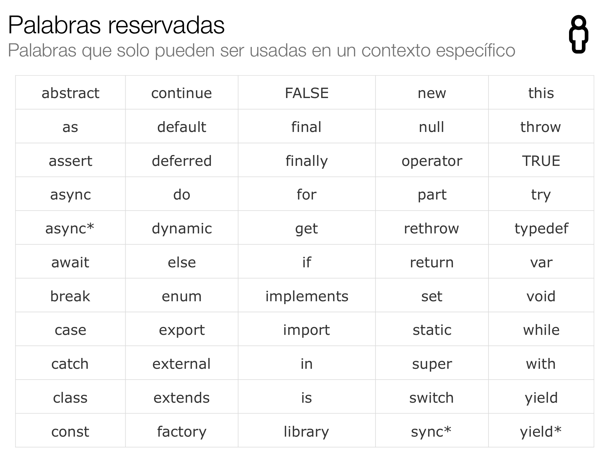

# Taller de Dart

*Este taller de dart es impulsado por la meta-comunidad de [FlossPA](https://floss-pa.net/) y dirigido por [Harry Alvarado](https://github.com/HarryAlvarado28).*

## Objetivos
Aprender ¿qué es Dart? su potencial y sintaxis.

## Concepto

**Dart** es un lenguaje optimizado por el cliente para aplicaciones rápidas en cualquier plataforma.

Potencial
- Optimizadopara UI
- Desarrollo productivo
- Rápido en todas las plataformas

```dart
/* Hola mundo en Dart */
main() {
  print("Hola, Mundo!");
}
```

## Contenido

### Palabras reservadas


### Tipo de datos

- Números *(int, double)*
- Strings
- Booleans
- Sets
- Maps

### Ejemplos de Tipo de datos

#### Números *(int, double)*

```dart
void main() {
// Numeros
  int a = 12;
  double b = 12.5;
  int c = a + 5;
  
  print(a);
  print(b);
  print(c);
    
  // Tambien ser permite
  int _d = 5;
  double $e = 5.4;
  print(_d);
  print($e);  
}
```

#### Strings

```dart
void main() {
// Strings - cadena de caracteres
  String nombre = 'Harry';
  String nombre2 = "Harry";
  String nombre3 = 'Harry\'s';
  
  print(nombre);
  print(nombre2);
  print(nombre3);
  
  String multilinea = '''Cuando se quieres hacer una variable que contenga multiples lineas se debe colocar tres comillas simples al principio de la cadena de caracteres y tres al final.''';
  
  print(multilinea);
  
}
```

#### Booleans

```dart
void main() {
// Booleans
  bool activo = true;
  bool vivo = false; 

  vivo = !vivo;
  
  print(activo);
  print(vivo);
}
```

### Variables


